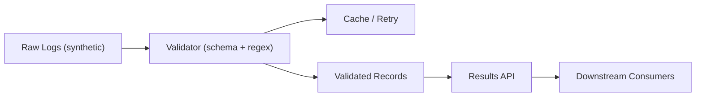
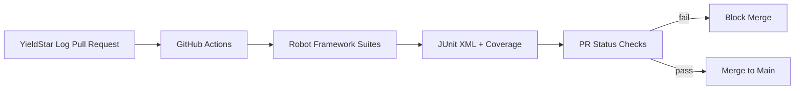
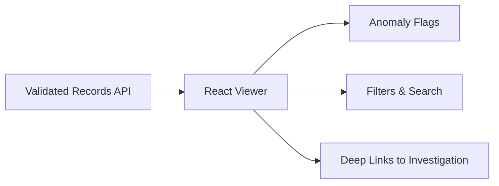
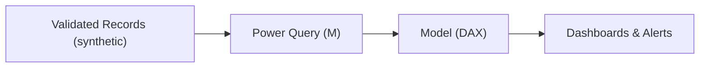

# ASML-System-Integration-and-Software-Testing-Engineer

**Role:** System Integration & Software Testing Intern (Part-Time: 24 hrs/wk)  

**When:** Jan 2024 – Dec 2024 · **Location:** Taipei, Taiwan  

> **Disclaimer:** This portfolio uses sanitized descriptions and **synthetic examples only**. No proprietary code, data, screenshots, internal IDs, or configurations from ASML are included.

---

## Projects at a Glance

| Project | Problem | What I Built | Result | Stack |
|---|---|---|---|---|
| **P1. YieldStar Log Quality Assurance Automated Pipeline** | Noisy and multi-source logs slowed triage | Python validator packaged as a one-click tool with schema/regex checks, caching, retry | **Processing time ↓ ~90%** | **Python**, **Pandas** (text analytics), **Pydantic/JSON Schema** (validation), **Pytest/Hypothesis** (tests), **Tenacity** (retry), **Redis** (cache) |
| **P2. Robot Framework API Test Suites & CI Quality Gates** | Post-merge defects surfaced late | Robot Framework API tests and GitHub Actions blocking PRs; JUnit reports for inspection | **Post-merge defects ↓ ~80%** | **Robot Framework**, **GitHub Actions**, **JUnit XML**, **pytest/coverage**, **pre-commit**, **Docker** |
| **P3. React Log Viewer with Anomaly Flags** | Slow handoff from ops to investigation | Web application with anomaly flags via threshold & timestamp checks | **Handoff-to-investigation time ↓ ~60%** | **React**, **TypeScript**, **React Query**, **Docker**, **REST API (Flask/FastAPI)** |
| **P4. PowerBI Ops Dashboards** | Limited visibility into yieldstar machine logs health | Power BI dashboards with daily refresh, health checks, and runbooks | Faster daily reviews that support **internal and external** projects | **Power BI**, **DAX**, **Power Query (M)**, **Scheduled Refresh**, **REST/CSV connectors**, **SQL** |

---

## P1 — YieldStar Log Quality-Assurance Automated Pipeline

**Problem:** Engineers manually parsed logs from multiple sources, delaying defect discovery.  

**Solution:** A validator packaged as a one-click tool that normalizes records, enforces schemas, flags anomalies, and caches results.

**Highlights:**
- Validation & normalization: Utilize schema and regex checks, and normalize timestamps and fields.
- Resilience: Caching and idempotent retries for unstable inputs.
- Tooling & tests: Command-line tool (CLI) and synthetic fixtures for unit tests.

**Impact:**
- Processing time **reduced ~90%**
- Packaged as a one-click CLI and adopted by the Software Testing team, now used daily in log triage

**Pipeline (simplified)**

---

## P2 — Robot Framework API Test Suites & CI Quality Gates

**Problem:** Yieldstar Machine Logs post-merge defects surfaced late and occasionally reached `main`.

**Solution:** Robot Framework API test suites run in GitHub Actions; failing checks **block PR merges**. Test outputs are surfaced as **JUnit XML** in the PR UI, with coverage reported.

**Highlights:**
- API checks: Ensure endpoints return correct status codes (e.g., 200/400), JSON matches the expected schema, and bad inputs produce clear errors.
- Consistent CI: Run automatic `pre-commit` checks and execute CI inside Docker so tests behave the same on every machine.
- Coverage: Use `pytest --cov` to report how much of the code is exercised by tests.

**Impact:**
- **Post-merge defects ↓ ~80%**

**Pipeline (simplified)**

---

## P3 — React Log Viewer with Anomaly Flags

**Problem:** Ops needed faster triage and clearer signals to move from logs to investigation state.

**Solution:** A React web app that highlights anomalies via threshold and timestamp checks, supports filters and search, and links directly to the source record for follow-up.

**Highlights:**
- See issues at a glance: Show row-level **anomaly badges** and time markers.
- Work faster: **Filter** by module, severity, and time window and **instant search**.
- One click to investigate: Build **deep links** to the exact record.
- Smooth data loading: **React Query** handles fetch, caching, and retries; **TypeScript** for safer user interface code.

**Impact:**
- **Handoff-to-investigation time ↓ ~60%**

**UI Flow (simplified)**

---

## P4 — Power BI Ops Dashboards

**Problem:** Daily job health and anomaly trends were scattered across tools, making status reviews slow and inconsistent.

**Solution:** A set of Power BI dashboards with daily refresh, health checks, and runbooks so ops can review status in minutes and know exactly what to do next.

**Highlights:**
- **Pipeline health:** Show success rate, latency, retry counts, recent failures, and so on.
- **Anomaly overview:** Flagged records by type, time, and module with drill-through and filters.
- **Runbooks:** Links to step-by-step fixes, owners, and escalation paths.
- **Reliable data flow:** Build Power Query (M) for shaping, scheduled refresh, and REST/CSV connectors bring in the sources.

**Impact:**
- Faster daily reviews and clearer ownership and escalation during incidents
- Used across **domestic and international** teams for daily status reviews and incident follow-ups

**Data Model (simplified)**

